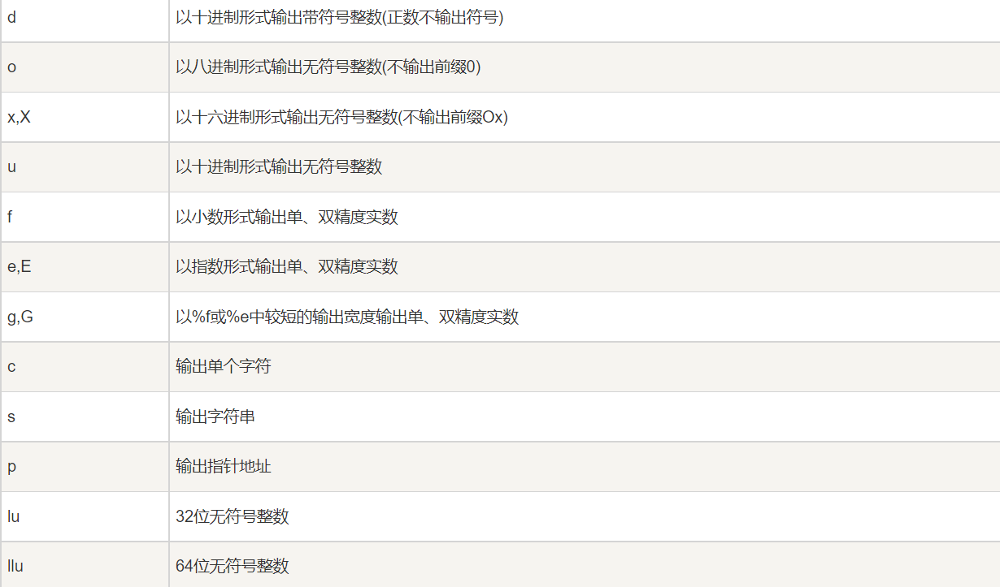

## 大致了解了`printf()`函数

起因是我在试图用`sizeof`打印数据类型对应大小时编写了如下代码

```c
int main(){
  int test = 1;
  printf(sizeof test);
}
```

gcc编译给出如下警告


尽管它输出了二进制文件a.out但是却无法正确运行并提示`Segmentation fault`

可能是受java的影响，我认为`printf()`会将将其他输入转化为String输出~~我知道c没有String类型~~，但是它不会

之后我向`printf()`输入了一个char类型数组

```c
int main(){
  char test[] = "abc";
  printf(test);
}
```

编译器仍然报警


但是输出的二进制文件可以正确执行

我也注意到了`format not a string literal and no format arguments`提示

## 正确操作

`printf("<格式化字符串>", <参量表>);`

意思是你可以

```c
printf("这是在打印一个char字符%c",'a')
```

其中%c代表char类型，函数会将输入的字符串中的%c换成第二个输入的变量并打印。可以使用的类似符号有以下



+ 疑问1：`printf();`函数是这样被定义的
  
  + ```c
    int printf(const char *format, ...){...}
    ```
  
  + 这个函数并不需要返回值，却被定义为int类型，而不是viod，并且当函数被定义为viod时，是可以被正常执行的，并不受到影响。同时`main()`函数也被int，但是即使不使用`return 0`返回值，编译器没有报错也未警告，运行也无问题。那么设置返回值的意义是什么？

+ 疑问2：为什么布尔型是`_Bool`有什么特殊含义吗？
