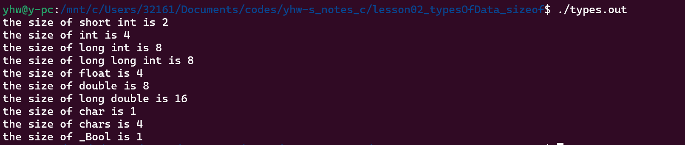

# 数据类型及长度

##### 了解c语言中各种数据类型，变量，常量的创建，数据所占的内存空间

使用``[修饰符] 数据类型 变量名``创建，也可以直接在后面接上``= <data>``直接赋值

+ 各种变量的大小
  
  + 
  
  + 注意，short int ; int ; long int ; long long int(c99新增) ;之规定了一次增大，并没规定具体长度，可能因编译器不同而有差别。
  
  + 从原理上可以将占用小的变量赋值给较大的类型，例如
  
  + ```c
    int teat = 'a'
    ```
  
  + 但是并不建议这么做~~废话~~

+ int类型，默认会用一个bit来表示正负，可以使用unsigned标记使其只表示大小
