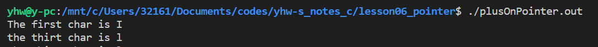
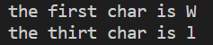

# 指针

--------------------

### 指针的创建

+ 基本方法
  
  ```c
  int a;
  int* pa = &a;//或 int *a;
  ```
  
  + 1. 指针指定的类型为被指向的数据类型。
    2. 在类型后或指针名前加“*”表示这是一个指针。
    3. “&”为取值运算符，返回变量在内存中的地址。
    4. “*”为取值运算符，返回指针指向内存中存放的数

--------------------

### 指针的调用

指针的调用非常简单，只需要在指针前加上取值符“*”即可，然后可对其进行赋值，读取等操作。

+ 例如:
  
  ```c
  *pa = 1;
  ```

--------------------

### 指针与数组1

+ 数组和指针非常像，数组名是指向数组内第一个元素的指针。
  
  ```c
  int Ints[] = {1,5,3,1,5,8};
    printf("the first num of Ints = %d\n",*Ints);
  ```

+ 你也可以使用指针创建数组
  
  ```c
    char* c = "abcdefg\n";//等同于 char c[] = "abcdefg";
    printf(c);
  ```

--------------------

### 指针的运算

+ 对指针做加法就是往后找元素。
  
  ```c
  char* a = "I love the world";
  printf("The first char is %c\n",*a);
  rintf("the thirt char is %c\n",*(a+2));
  ```



可以看到输出流第三个字符l（空格也是一个字符），注意，对指针+1并不是去寻找下一个byte，而是下一个元素，比如int指针就会向下4位，正好是一个int的大小。

啥？你问编译器咋知道要移动几位？你申明指针的时候不是说了吗。

你也可以对数组使用相同的操作

```c
char b[] ="Will i be loved?";
printf("the first char is %c\n",*b);
printf("the thirt char is %c\n",*(b+2));
```



--------------------

### 指针与数组2
